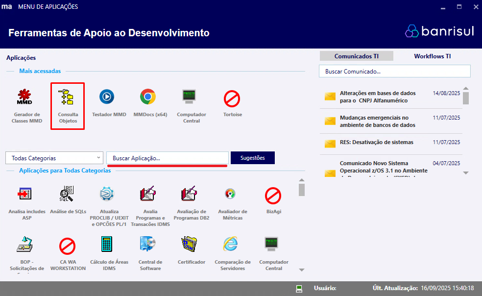
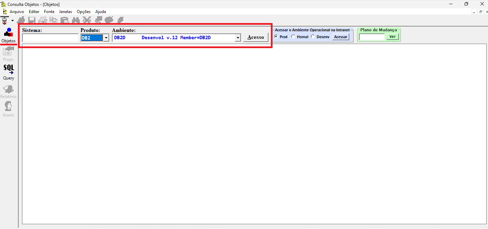
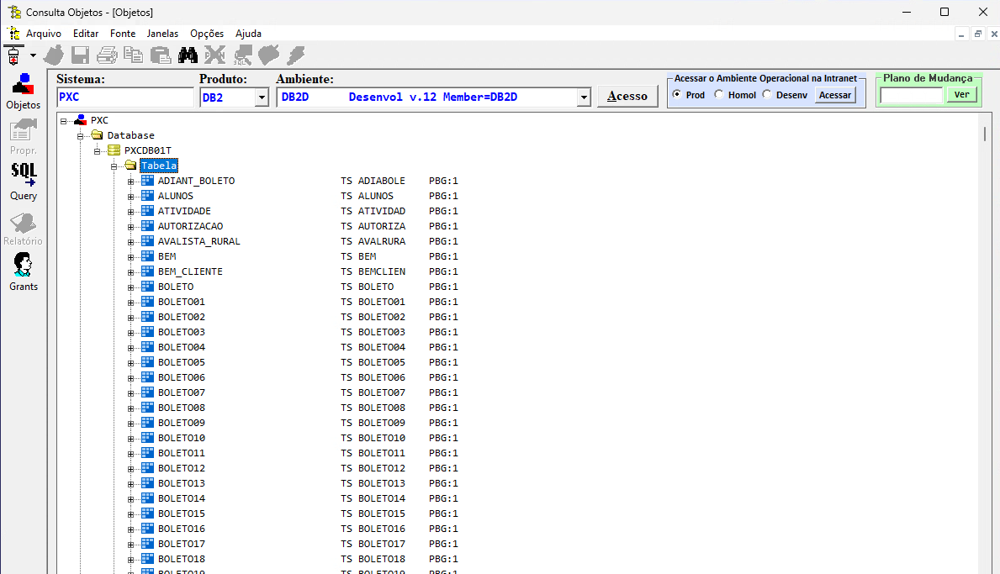
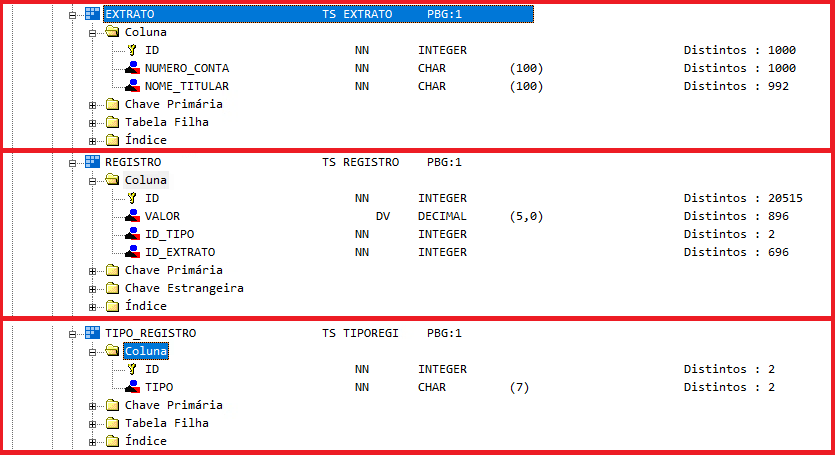
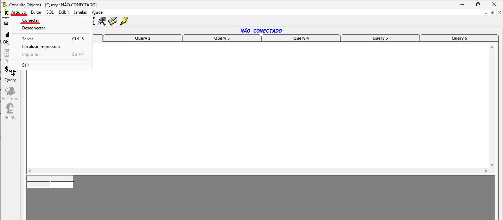
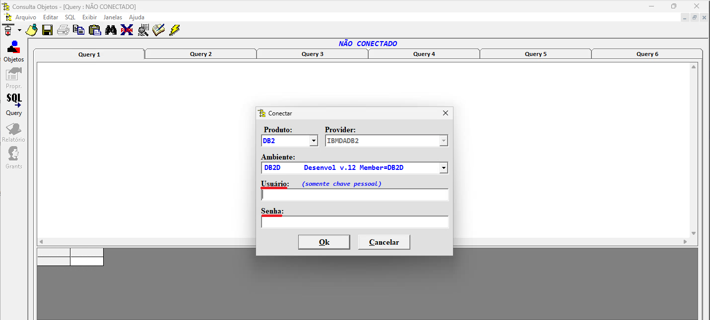
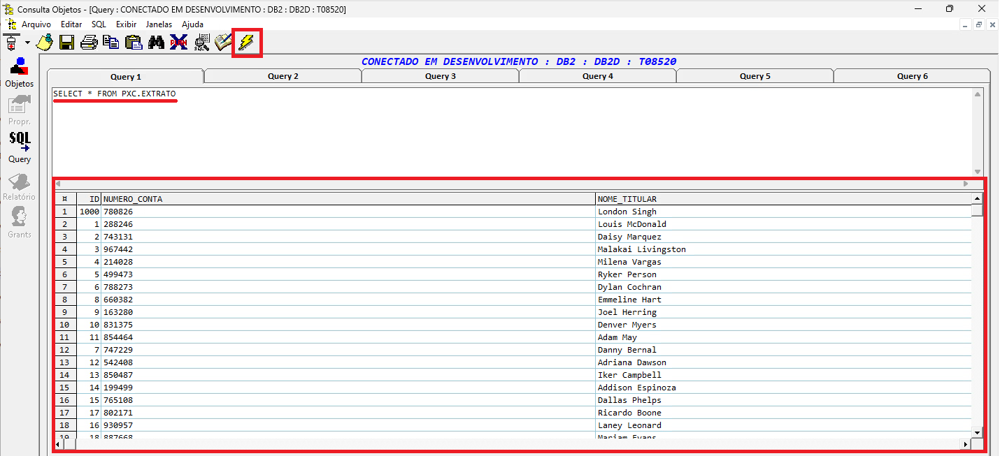

### Usando o Consulta Objetos

O software **Consulta Objetos** é o programa utilizado no ambiente do Banrisul para acessar o banco DB2 e será o que utilizaremos para acessar as tabelas **EXTRATO**, **TIPO_REGISTRO** e **REGISTRO** para seguirmos com o treinamento.

---

### 1. Abrindo o Software

Encontrar o programa **Consulta Objetos** não é difícil. Basta abrir o **PZP - Menu de Aplicações** e, caso este não aparecer no campo **"Mais acessadas"**, basta buscar pelo nome da aplicação no campo de pesquisa evidenciado na imagem abaixo.

### 2. Familiarizando-se com a Visualização de Objetos

Após o programa ter aberto, certifique-se de clicar no menu **Objetos** caso a aplicação não esteja com esta opção selecionada e depois preencha o campo **Sistema** com o valor **PXC** e selecione a opção **DB2** no campo **Produto** e **DB2D    Desenvolv v.12 Member=DB2D**
no campo **Ambiente**. Então, finalmente, clique no botão **Acesso**.

Após o procedimento acima ter sido executado, será possível visualizar a lista de banco de dados do sistema PXC e suas respectivas tabelas. Na imagem abaixo, abrimos o único banco que aparece como disponível **(PXCDB01T)** e clicamos na pasta **Tabela**.
As tabelas que irão aparecer são as mesmas que aparecem no **BOP Web** quando é realizado a requisição de acesso a tabelas do sistema PXC.

Agora, procure as tabelas **EXTRATO**, **REGISTRO** e **TIPO_REGISTRO** na lista. Expanda elas e abra a pasta **Coluna** em cada uma para visualizar as suas estruturas.

### 3. Executando queries

No menu lateral esquerdo, busque a opção **Query**. Após ter entrado na view de queries, você perceberá uma mensagem na parte superior dizendo **Não Conectado**. Para resolver isso, basta clicar em **Arquivo** na parte lateral esquerda superior e então em **Conectar**.

Aparecerá no meio da aplicação o menu de conexão onde deve-se preencher o campo **Usuário** com a sua matrícula e o campo **Senha** com a sua senha do computador central.

Após a conexão ter obtido êxito, você poderá escrever suas queries no campo de texto disponível e, quando quiser executar uma query, basta clicar no ícone de raio na parte lateral esquerda superior. Abaixo pode-se ver um exemplo de operação com a query
**"SELECT \* FROM PXC.EXTRATO"**, a qual resultou na exibição dos valores presentes em todas as colunas da tabela **EXTRATO**. 
**Perceba que na query o nome da tabela vem acompanhado do prefixo "PXC.". Esse padrão deverá estar presente em todas as tabelas que forem mencionadas em queries que fazerem parte do PXC (todas as tabelas utilizadas como exemplo neste treinamento).**

