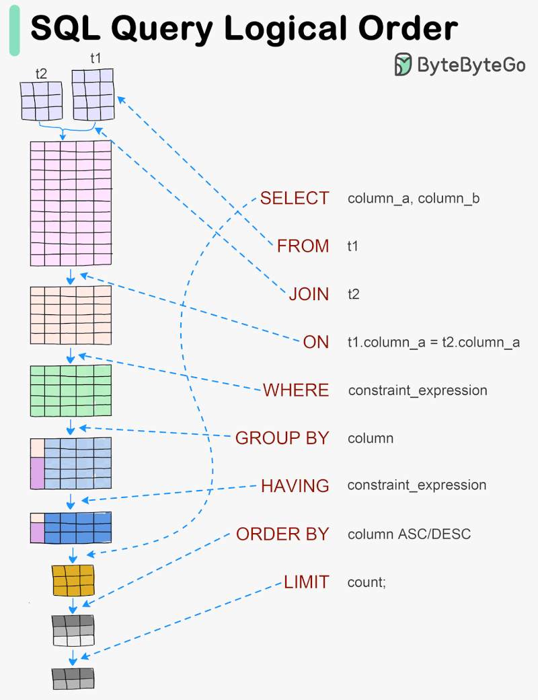

A **ordem lógica de processamento** de uma consulta SQL define a sequência em que o mecanismo do banco de dados processa os componentes da consulta, independentemente da ordem em que eles aparecem na instrução SQL que escrevemos. Embora o código SQL seja escrito geralmente começando com o `SELECT`, o banco de dados processa diferentes partes da consulta em uma ordem específica internamente.

Aqui está a **ordem lógica de processamento** de uma consulta SQL:

1. **FROM**  
   A primeira etapa é determinar as fontes de dados que serão consultadas. O mecanismo do banco de dados identifica e carrega as tabelas ou vistas referenciadas na consulta.

2. **ON**  
   Se houver uma cláusula `JOIN`, o banco de dados avalia a condição `ON` para filtrar quais linhas devem ser combinadas entre as tabelas envolvidas na junção.

3. **JOIN**  
   A junção das tabelas é realizada de acordo com as condições especificadas (como `INNER JOIN`, `LEFT JOIN`, etc.).

4. **WHERE**  
   Depois que as tabelas são unidas, a cláusula `WHERE` é aplicada para filtrar as linhas com base nas condições fornecidas.

5. **GROUP BY**  
   As linhas resultantes são agrupadas com base nas colunas especificadas na cláusula `GROUP BY`.

6. **HAVING**  
   Depois que os grupos são formados, a cláusula `HAVING` filtra os grupos com base em condições específicas (normalmente usadas com funções de agregação).

7. **SELECT**  
   Após a aplicação de filtros e agrupamentos, o banco de dados seleciona as colunas ou expressões a serem exibidas no resultado final.

8. **DISTINCT**  
   Se a palavra-chave `DISTINCT` for usada, os registros duplicados são removidos do conjunto de resultados.

9. **ORDER BY**  
   As linhas resultantes são ordenadas com base nas colunas ou expressões especificadas na cláusula `ORDER BY`.

10. **LIMIT/OFFSET**  
    Finalmente, se houver uma cláusula `LIMIT` (ou equivalente), o banco de dados limita o número de linhas retornadas, e `OFFSET` pula as primeiras N linhas, se especificado.

---




### Exemplo:

```sql
SELECT DISTINCT NOME_TITULAR, SUM(R.VALOR) 
FROM EXTRATO E 
JOIN REGISTRO R ON E.ID = R.ID_EXTRATO
WHERE R.VALOR > 100
GROUP BY NOME_TITULAR
HAVING SUM(R.VALOR) > 1000
ORDER BY NOME_TITULAR;
```

#### Processamento Lógico:

1. **FROM**: Tabela **EXTRATO** (E) e **REGISTRO** (R) são referenciadas.
2. **ON**: A junção é feita entre **EXTRATO** e **REGISTRO** onde `E.ID = R.ID_EXTRATO`.
3. **JOIN**: As tabelas são unidas.
4. **WHERE**: Linhas onde `R.VALOR > 100` são filtradas.
5. **GROUP BY**: Agrupamento pelas colunas `NOME_TITULAR`.
6. **HAVING**: Filtragem dos grupos onde a soma dos valores `SUM(R.VALOR)` é maior que 1000.
7. **SELECT**: Colunas `NOME_TITULAR` e a soma `SUM(R.VALOR)` são selecionadas.
8. **DISTINCT**: Remove duplicatas (caso existam).
9. **ORDER BY**: Ordenação por `NOME_TITULAR` em ordem alfabética.

---

Compreender a ordem lógica de processamento ajuda a evitar confusões, como tentar filtrar resultados de agregações diretamente na cláusula `WHERE` (o que não funcionaria, pois as agregações são calculadas após o `WHERE`).